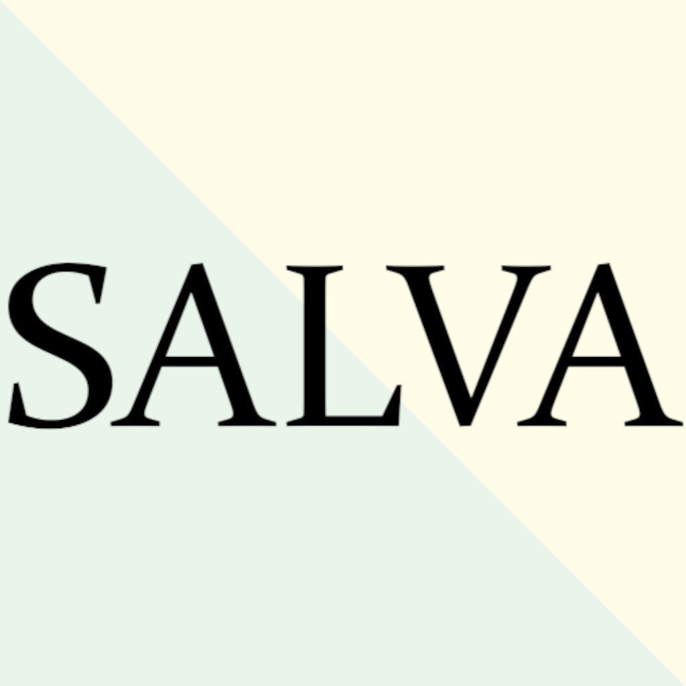

# Salva

Welcome to Salva, our privacy focused, minimalist, intuitive and lightweight transaction tracking companion.

In today's fast-paced world, staying on top of your finances can be a daunting task. Juggling multiple bank accounts, credit cards, and cash transactions can leave you feeling overwhelmed and disorganized. Introducing Salva, the minimalist, intuitive, and lightweight transaction tracking app designed to bring clarity and simplicity to your financial life.

## Prioritizing Privacy

We've built our app with security and privacy at the forefront. Your user data never leaves your device, ensuring complete privacy and control over your personal information. Most apps in this category require giving 3rd parties access to your sensitive financial information. That increases the likelihood of your personal data being compromised during a data breach, and potentially subject you to fraud, spam, and other security risks. Salva requests only minimal access to your local storage and does not collect any personal information.
You can back up your records to your local storage at any time. Make sure to do so often! You can restore all your transactions from the backup in case of switching phones or after a factory reset.

## Minimalist Design

Salva's minimalist design puts the focus on what matters most: tracking your transactions. Our streamlined interface eliminates clutter and distractions, making it easy to view, categorize, and analyze your spending habits.

## Intuitive and Easy to Use

We've designed Salva to be intuitive and easy to use, even for those unfamiliar with financial tracking apps. Our simple navigation and clear instructions make it effortless to get started and maintain your financial records.

## Lightweight and Efficient

Salva is a lightweight app that won't weigh down your device or drain your battery. We've optimized our app to run efficiently, ensuring a smooth and responsive experience.

## Extensive Functionality

The app supports an ever expanding, enviable list of options. With Salva you can:
- Save, edit and remove transactions with ease
- Use entities and categories to classify and group your transactions
- Modify or remove your existing entities and categories
- Visualize your transactions plotted on a graph or organized on a calendar
- Monitor consumption rate, savings rate, and many other useful metrics
- Filter and sort through your transaction history
- Search for records using specific criteria
- Export your transactions to a CSV file
- Save a backup of your transactions to your local storage
- Restore your transactions from a previously generated backup file

---

## [Privacy Policy](privacypolicy.md)
## [Terms of Service](termsofservice.md)
